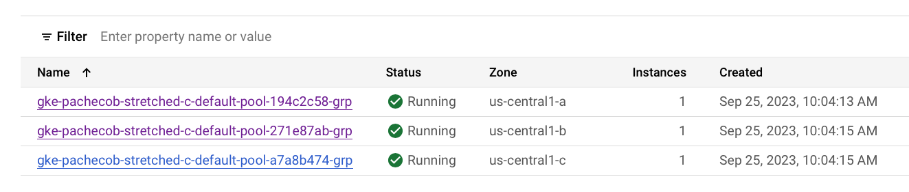

# Deploying Crunchy Postgres for Kubernetes in a Multi-Zone Cluster

## Terminology
* Multi-Zone Cluster - A kubernetes cluster that spans multiple availability zones.
* Regions - Regions are collections of zones. Zones have high-bandwidth, low-latency network connections to other zones in the same region.
* Availability Zones - A zone is a deployment area within a region.

## Overview
You want to eliminate single points of failure at the data center (availability zone) or geographical location (region).  You decide to establish a multi-zone kubernetes cluster for the purpose of deploying and hosting your Crunchy Postgres for Kubernetes (CPK) Clusters.  You want to ensure that each availability zone has one or more postgres pods running in it.  We will use a combination of PostgresCluster.spec.instances and node affinity to enable this functionality.

To avoid performance issues, it is generally a good idea to not create kubernetes clusters across regions.  The regions have not been optimized for high-bandwidth, low-latency network connections for cross region communications.  Instead, you should consider creating your kubernetes clusters across multiple availability zones within the same region and use a [stand-by CPK cluster](https://access.crunchydata.com/documentation/postgres-operator/latest/architecture/disaster-recovery) in a different region to solve the geographical single point of failure problem.

## The Kubernetes Cluster
Using GKE, I setup a cluster with 1 kubernetes node in 3 availability zones:


**Note:** As a prerequisite, I installed the latest version of the CPK Operator in my kubernetes cluster.  Steps to do that can be found [here](https://access.crunchydata.com/documentation/postgres-operator/latest/quickstart).  

## Working with PostgresCluster Instances
The Postgres cluster spec supports a collection of instances.  An instance is a grouping of Postgres pods where you can define:

* replica counts
* resources
* affinities
* taints

A typical postgres cluster will have only one instance defined with multiple replicas.  However, for this scenario, we will create an instance for each availability zone within our kubernetes cluster.

## The Custom Resource
We create one instance in our PostgresCluster.spec.instances collection for each availability zone that we want to deploy our postgres pods into.  We set the instance name to align with the availability zone name so we can determine that our pod assignments are working as expected.  We set 1 replica per instance and add a node affinity section to the instance to associate each instance with the desired availability zone.  Our PostgresCluster custom resource looks like this:


<details><summary>- ha-multi-zone.yaml</summary>

```yaml
apiVersion: postgres-operator.crunchydata.com/v1beta1
kind: PostgresCluster
metadata:
  name: hippo-ha
spec:
  image: registry.crunchydata.com/crunchydata/crunchy-postgres:ubi8-15.4-0
  imagePullSecrets:
  - name: crunchyreg
  postgresVersion: 15
  instances:
    - name: zone-a
      replicas: 1
      dataVolumeClaimSpec:
        accessModes:
        - "ReadWriteOnce"
        resources:
          requests:
            storage: 1Gi
      affinity:
        podAntiAffinity:
          preferredDuringSchedulingIgnoredDuringExecution:
          - weight: 1
            podAffinityTerm:
              topologyKey: kubernetes.io/hostname
              labelSelector:
                matchLabels:
                  postgres-operator.crunchydata.com/cluster: hippo-ha
                  postgres-operator.crunchydata.com/instance-set: zone-a
        nodeAffinity:
          requiredDuringSchedulingIgnoredDuringExecution:
            nodeSelectorTerms:
            - matchExpressions:
              - key: topology.kubernetes.io/zone
                operator: In
                values:
                - us-central1-a
    - name: zone-b
      replicas: 1
      dataVolumeClaimSpec:
        accessModes:
        - "ReadWriteOnce"
        resources:
          requests:
            storage: 1Gi
      affinity:
        podAntiAffinity:
          preferredDuringSchedulingIgnoredDuringExecution:
          - weight: 1
            podAffinityTerm:
              topologyKey: kubernetes.io/hostname
              labelSelector:
                matchLabels:
                  postgres-operator.crunchydata.com/cluster: hippo-ha
                  postgres-operator.crunchydata.com/instance-set: zone-b
        nodeAffinity:
          requiredDuringSchedulingIgnoredDuringExecution:
            nodeSelectorTerms:
            - matchExpressions:
              - key: topology.kubernetes.io/zone
                operator: In
                values:
                - us-central1-b
    - name: zone-c
      replicas: 1
      dataVolumeClaimSpec:
        accessModes:
        - "ReadWriteOnce"
        resources:
          requests:
            storage: 1Gi
      affinity:
        podAntiAffinity:
          preferredDuringSchedulingIgnoredDuringExecution:
          - weight: 1
            podAffinityTerm:
              topologyKey: kubernetes.io/hostname
              labelSelector:
                matchLabels:
                  postgres-operator.crunchydata.com/cluster: hippo-ha
                  postgres-operator.crunchydata.com/instance-set: zone-c
        nodeAffinity:
          requiredDuringSchedulingIgnoredDuringExecution:
            nodeSelectorTerms:
            - matchExpressions:
              - key: topology.kubernetes.io/zone
                operator: In
                values:
                - us-central1-c
  backups:
    pgbackrest:
      image: registry.crunchydata.com/crunchydata/crunchy-pgbackrest:ubi8-2.47-0
      repos:
      - name: repo1
        volume:
          volumeClaimSpec:
            accessModes:
            - "ReadWriteOnce"
            resources:
              requests:
                storage: 1Gi
```

</details>
</br>


We have 3 instances:
* zone-a
* zone-b
* zone-c

We deploy our postgres cluster to our multi-zone cluster using our custom resource:

```bash
kubectl apply -n postgres-operator -k ha-multi-zone
```
Once the cluster is up and running we can check our postgres pod host assignments:

```bash
robertpacheco@Roberts-MBP kustomize % kubectl -n postgres-operator get po -o wide
NAME                                  READY   STATUS    RESTARTS   AGE    IP           NODE                                                  NOMINATED NODE   READINESS GATES
hippo-ha-repo-host-0                  2/2     Running   0          2m8s   10.36.0.5    gke-pachecob-multi-zone-c-default-pool-194c2c58-5jpf   <none>           <none>
hippo-ha-zone-a-ft66-0                4/4     Running   0          2m8s   10.36.0.4    gke-pachecob-multi-zone-c-default-pool-194c2c58-5jpf   <none>           <none>
hippo-ha-zone-b-cmtc-0                4/4     Running   0          2m8s   10.36.2.4    gke-pachecob-multi-zone-c-default-pool-271e87ab-w82c   <none>           <none>
hippo-ha-zone-c-qwf6-0                4/4     Running   0          2m8s   10.36.1.17   gke-pachecob-multi-zone-c-default-pool-a7a8b474-m117   <none>           <none>
pgo-6f49bf65c4-thw2m                  1/1     Running   0          3d1h   10.36.1.10   gke-pachecob-multi-zone-c-default-pool-a7a8b474-m117   <none>           <none>
```

We can compare them to our node list:


We see that the zone-a pod is running on the zone a cluster node.  The zone-b and zone-c pods are also running on the correct nodes.

Now lets verify that our pod will not be moved into another availability zone if it loses its host.  I will go into the Google Cloud console and cordon one of my kubernetes nodes.  This will make that node unschedulable for any pods.  In this case I chose to cordon the zone-b node.

I then delete the zone-b postgres pod.  When the reconciler recreates it the pod will go into and stay in a pending state until its host node becomes available again.

```bash
kubectl delete -n postgres-operator pod hippo-ha-zone-b-cmtc-0
pod "hippo-ha-zone-b-cmtc-0" deleted
```
Notice that hippo-ha-zone-b-cmtc-0 is now in a pending state.

```bash
kubectl -n postgres-operator get pods
NAME                                  READY   STATUS      RESTARTS   AGE
hippo-ha-repo-host-0                  2/2     Running     0          14m
hippo-ha-zone-a-ft66-0                4/4     Running     0          14m
hippo-ha-zone-b-cmtc-0                0/4     Pending     0          30s
hippo-ha-zone-c-qwf6-0                4/4     Running     0          14m
pgo-6f49bf65c4-thw2m                  1/1     Running     0          3d1h
```

If we describe that pod and look at the events in the output we see why:

```bash
kubectl describe -n postgres-operator pod hippo-ha-zone-b-cmtc-0
...
Events:
  Type     Reason             Age    From                Message
  ----     ------             ----   ----                -------
  Warning  FailedScheduling   2m19s  default-scheduler   0/3 nodes are available: 1 node(s) were unschedulable, 2 node(s) didn't match Pod's node affinity/selector. preemption: 0/3 nodes are available: 3 Preemption is not helpful for scheduling..
  Warning  FailedScheduling   2m17s  default-scheduler   0/3 nodes are available: 1 node(s) were unschedulable, 2 node(s) didn't match Pod's node affinity/selector. preemption: 0/3 nodes are available: 3 Preemption is not helpful for scheduling..
  Normal   NotTriggerScaleUp  2m17s  cluster-autoscaler  pod didn't trigger scale-up:
```

We see that 0/3 nodes are available: 1 node(s) were unschedulable, 2 node(s) didn't match Pod's node affinity/selector.  This is exactly the behavior we are expecting.  Our node affinity is working as expected.

Now lets uncordon the zone-b node.  Once I do, I see that the hippo-ha-zone-b-cmtc-0 pod is now scheduled on the node in zone-b again and it is up and running.

```bash
kubectl -n postgres-operator get pods
NAME                                  READY   STATUS      RESTARTS   AGE
hippo-ha-repo-host-0                  2/2     Running     0          20m
hippo-ha-zone-a-ft66-0                4/4     Running     0          20m
hippo-ha-zone-b-cmtc-0                4/4     Running     0          6m22s
hippo-ha-zone-c-qwf6-0                4/4     Running     0          20m
pgo-6f49bf65c4-thw2m                  1/1     Running     0          3d1h
```

## Summary
Crunchy Postgres for Kubernetes is incredibly versatile.  Today we learned how to take advantage of that versatility to deploy highly available postgres clusters on a multi-zone kubernetes cluster.  This technique eliminates the possibility of a single point of failure at the availability zone level.  Check out our other blogs [on our website](https://www.crunchydata.com/blog).